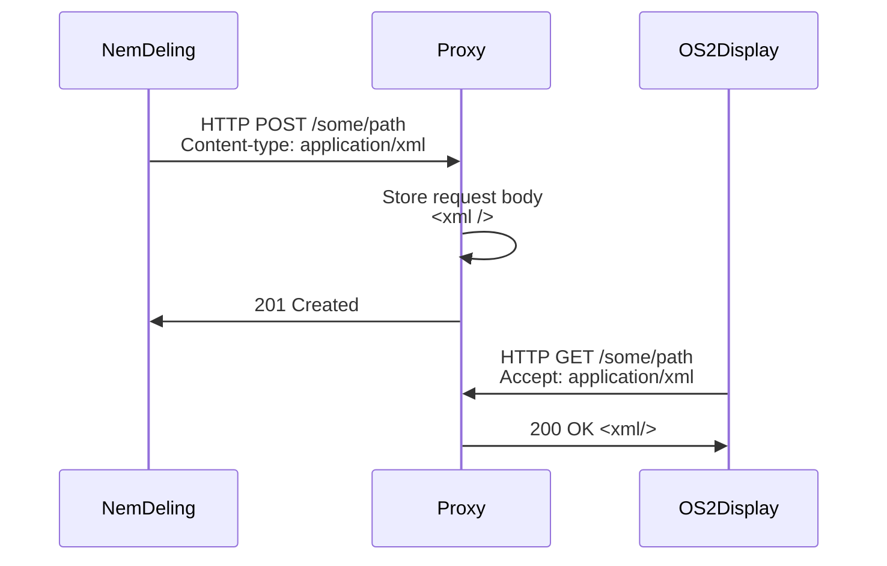

# OS2Display Proxy

## Description

The OS2Display proxy is a webservice which supports the transition from direct
integration between KK Drupal 7 multisites to the NemDeling service which acts
as an aggregator and mediator of site data and external services such as
OS2Display.

The proxy allows for the 1.x version of OS2Display to continue working
with few modifications while integrating with NemDeling. There are two
key differences compared to the integration with KK Multisites:

1. NemDeling pushes data to external services. Slides used by KK are built to
   pull data from external services.
2. NemDeling aggregates data from all sites. Slides are built to pull data from
   individual site(s).

### Data flow

This has lead to a simple architecture where an external service (NemDeling) can
push data to endpoints at the proxy using `POST` requests while another external
service can retrieve pushed data from the same endpoints using `GET` requests.

Headers indicating the content type of the data are generally preserved and 
respected. Practice has shown most pushes to be XML.

While any endpoints are currently accepted the following are known to be in use
at the moment:

- `/event-posters`
- `/events`
- `/service-messages`

### Filtering

As slides should only show a subset of all data the endpoints support filtering:

- `display`: Content is filtered by which screen/display the content is linked
             to in NemDeling
- `place`: Content is filtered by the location the content is linked to in
           NemDeling

Filters return content based on XML filtering of the pushed data.

## Implementation

The project is implemented in [Laravel](https://laravel.com/) and can be 
deployed to [Platform.sh](https://platform.sh/). It is based on [the official
template for integrating the two](https://github.com/platformsh-templates/laravel).

The core logic in implemented in the [`RequestResponseController`](app/Http/Controllers/RequestResponseController.php)
and tested in [`RequestResponseTest`](tests/Feature/RequestResponseTest.php).

## Local development

You can get an local development environment up an running using Git, Composer, 
Docker and [Laravel Sail](https://laravel.com/docs/9.x/sail):

1. `git clone https://github.com/kkos2/os2display-proxy`
2. `cd os2display-proxy`
3. `composer install`
4. `cp .env.example .env`
5. `vendor/bin/sail up -d`
6. `vendor/bin/sail artisan migrate:fresh`
7. `vendor/bin/sail artisan test`

When all steps are completed you should have a working installation of the proxy
available at `http://localhost`.

You can modify the `.env` file to suite your needs e.g. change which port the
service is exposed on.

### XDebug

Modify `docker-compose.yml` to support XDebug. For some reason [the default
XDebug support by Sail](https://laravel.com/docs/9.x/sail#debugging-with-xdebug)
does not work.

## Deployment

When the proxy is deployed to Platform.sh you can push to the `main` branch of
the proxy repository.
